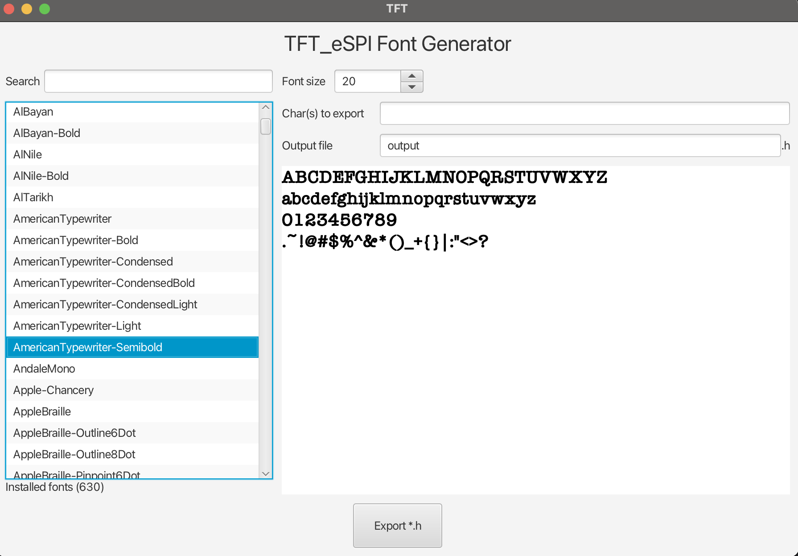

# TFT_eSPI_Font with GUI

## 介绍
本项目基于 <a href="https://github.com/tangdoit/TFT_eSPI_Font">TFT_eSPI_Font</a> 利用 JavaFX 构建了界面，方便用户筛选字体并生成对应的 *.h 文件

## 开发&测试 环境
* Windows 10 / MacOS 14.x
* Intellij IDEA
* Maven
* JDK 21

## 使用方法
1. 从Release下载最新的jar包
2. 请确保配置了Java21的环境
3. 【Windows】打开cmd，找到jar包所在位置，运行 `java -jar TFT_eSPI_Font_with_GUI.jar`，
4. 【MacOS】打开终端（terminal），找到jar包所在位置，运行 `java -jar TFT_eSPI_FONT_JFX_1.0.jar`
